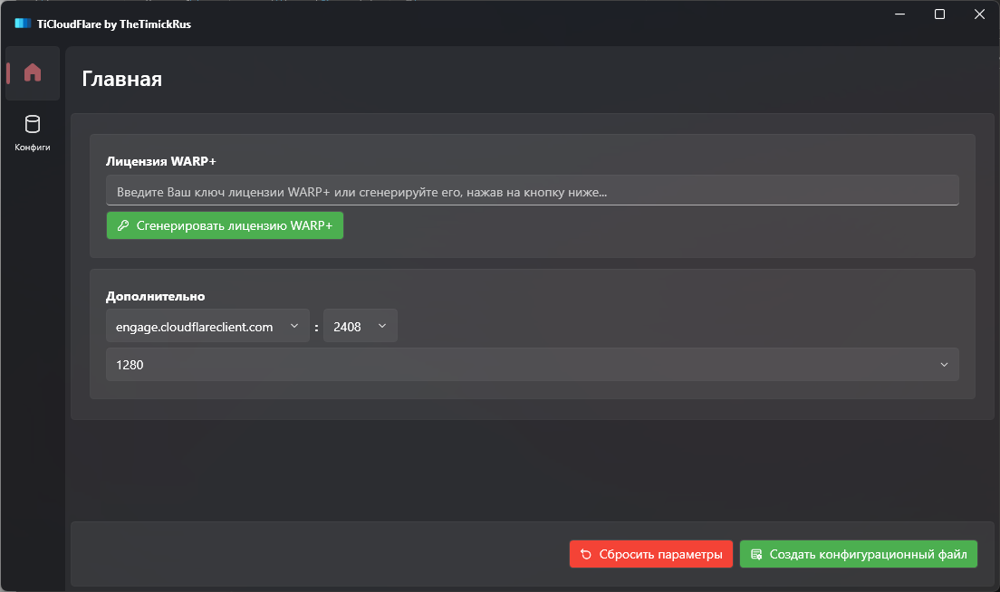

# TiCloudFlare
 Создание .config и .toml файлов для WireGuard. Программа работает на основе [wgcf](https://github.com/ViRb3/wgcf).

# Что делать?
 * Скачиваете [WireGuard](https://www.wireguard.com/) для своей платформы с официального сайта
 * Скачиваете последнюю версию данной программы
     * Генерируете лицензию WARP+
     * Генерируете файл конфигурации
 * Добавляете полученный конфиг-файл в программу WireGuard
 * Радуетесь!
 
# Скриншоты

# Спасибо
 * [wgcf](https://github.com/ViRb3/wgcf)
 * [Скрипт PowerShell с 4PDA](https://4pda.to/forum/index.php?showtopic=929115&st=3540#entry115275764)
